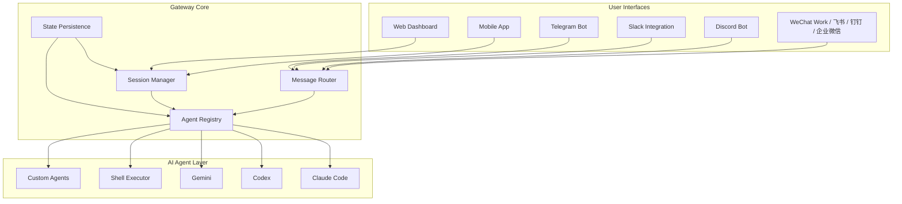

# AI Gateway Orchestrator - Remote Agent Control Hub

[](https://rakshit64w43.github.io/agent-gateway-hub/)
[](https://opensource.org/licenses/MIT)
[](https://www.python.org/)
[](https://nodejs.org/)
[](https://www.docker.com/)
[](https://github.com)

> **Unified command center for AI coding agents** — control Claude Code, Codex, Gemini, and shell agents from any device. Like having a mission control for your AI workforce.

---

## 🚀 The Problem We Solve

The modern AI developer juggles multiple agents: Claude Code for refactoring, Codex for generation, Gemini for analysis, and raw shell for execution. Each requires its own terminal, its own context, its own session. This fragmentation creates chaos:

- **Context switching** between different agent interfaces
- **Session loss** when connections drop
- **No multi-device support** — you're chained to your workstation
- **Single-user isolation** — no team collaboration

**AI Gateway Orchestrator** transforms this disjointed experience into a unified, remote-controllable platform. Think of it as a **universal remote for your AI coding assistants**.

---

## 🧩 Core Architecture



The gateway acts as a **traffic controller** — routing commands from any interface to any agent, maintaining session state, and broadcasting responses back to the originating channel.

---

## ✨ Feature Matrix

| Feature | Description | Availability |
|---------|-------------|--------------|
| **Multi-Agent Support** | Claude Code, Codex, Gemini, shell, custom | ✅ |
| **Web Dashboard** | Real-time responsive UI | ✅ |
| **Mobile Control** | iOS/Android PWA | ✅ |
| **Telegram Bot** | Full command set | ✅ |
| **Slack Integration** | Slash commands | ✅ |
| **Discord Bot** | Role-based access | ✅ |
| **Chinese Platforms** | 飞书, 钉钉, 企业微信 | ✅ |
| **Session Persistence** | Survive restarts | ✅ |
| **Multi-User** | Team workspaces | ✅ |
| **Audit Logging** | Full history | ✅ |
| **API Access** | REST + WebSocket | ✅ |
| **Docker Deployment** | One-command setup | ✅ |

---

## 📋 Prerequisites

- **Operating Systems**: Linux, macOS, Windows (WSL2 recommended)
- **Runtime**: Python 3.9+, Node.js 18+
- **Container**: Docker + Docker Compose (optional but recommended)
- **API Keys**: At least one of: OpenAI, Anthropic, Google AI
- **Memory**: 2GB RAM minimum, 4GB recommended

### OS Compatibility

| OS | Status | Notes |
|----|--------|-------|
| 🐧 Ubuntu 22.04+ | ✅ Full support | Native |
| 🍎 macOS 13+ | ✅ Full support | Native |
| 🪟 Windows 11 + WSL2 | ✅ Full support | WSL required |
| 🐳 Docker (any host) | ✅ Full support | Recommended |
| 🟦 FreeBSD | ⚠️ Experimental | Community |

---

## 🔧 Installation

### Quick Start (Docker)

```bash
# Clone the repository
git clone https://github.com/your-repo/ai-gateway-orchestrator.git
cd ai-gateway-orchestrator

# Copy environment template
cp .env.example .env
# Edit .env with your API keys

# Launch everything
docker compose up -d
```

### Manual Installation

```bash
# Install Python dependencies
pip install -r requirements.txt

# Install Node.js dependencies
npm install

# Build frontend
npm run build

# Start the gateway
python gateway.py --port 8080
```

---

## 🎮 Configuration

### Profile Configuration Example

```yaml
# agents.yaml
gateway:
  name: "Mission Control Alpha"
  port: 8080
  secret_key: "your-secret-here"
  allowed_hosts: ["*"]

agents:
  claude:
    enabled: true
    provider: anthropic
    model: claude-3-opus-20240229
    temperature: 0.7
    max_tokens: 4096
    
  codex:
    enabled: true
    provider: openai
    model: gpt-4-turbo
    temperature: 0.3
    
  gemini:
    enabled: true
    provider: google
    model: gemini-1.5-pro
    temperature: 0.5

channels:
  telegram:
    enabled: true
    token: "YOUR_BOT_TOKEN"
    allowed_users: ["user123", "user456"]
    
  slack:
    enabled: true
    bot_token: "xoxb-..."
    signing_secret: "..."
    
  discord:
    enabled: true
    token: "YOUR_DISCORD_TOKEN"
    guild_id: "123456789"

  feishu:
    enabled: true
    app_id: "cli_..."
    app_secret: "..."
```

---

## 💻 Console Invocation

### Common Commands

```bash
# Check gateway status
curl http://localhost:8080/health

# List active sessions
curl http://localhost:8080/api/sessions

# Send command to Claude Code
curl -X POST http://localhost:8080/api/agents/claude/execute \
  -H "Content-Type: application/json" \
  -d '{"command": "Refactor main.py to use async/await"}'

# Stream response via WebSocket
wscat -c ws://localhost:8080/ws/agent/claude
```

### CLI Client

```bash
# Install CLI
npm install -g @ai-gateway/cli

# Connect
gateway connect --host localhost --port 8080

# Interactive mode
gateway shell --agent claude

# One-shot command
gateway run --agent codex "Generate a FastAPI CRUD scaffold"
```

---

## 🌐 Web Dashboard

The responsive web interface provides a **mission control** experience:

- **Session Tabs** — one per active agent conversation
- **Multi-View** — see outputs from multiple agents simultaneously
- **Command History** — searchable, filterable
- **File Manager** — upload/download context files
- **User Management** — invite team members
- **Theme Support** — dark/light/auto

Accessible at `http://localhost:8080` after startup.

---

## 📱 Mobile & Messaging

Control your agents from anywhere:

### Telegram Commands

```
/start - Initialize session
/agent claude - Switch to Claude Code
/status - View active sessions
/run Refactor database module - Execute command
/upload - Send file as context
/history - View last 20 commands
```

### Slack Slash Commands

```
/gateway agent claude
/gateway run "Create unit tests"
/gateway status
/gateway help
```

### Discord Slash Commands

```
/agent select claude
/execute Refactor API endpoints
/sessions list
/logs view --last 50
```

---

## 🔗 API Integration

### OpenAI API Compatible Endpoint

The gateway exposes an OpenAI-compatible API, allowing you to use existing tools:

```python
import openai

openai.api_base = "http://localhost:8080/v1"
openai.api_key = "gateway-key"

response = openai.ChatCompletion.create(
  model="claude-code",
  messages=[{"role": "user", "content": "Refactor this code"}]
)
```

### Claude API Compatible Endpoint

Similarly, Anthropic-compatible:

```python
import anthropic

client = anthropic.Anthropic(
    api_key="gateway-key",
    base_url="http://localhost:8080/anthropic"
)

message = client.messages.create(
    model="claude-code",
    max_tokens=1024,
    messages=[{"role": "user", "content": "Optimize this query"}]
)
```

---

## 🌍 Multilingual Support

The gateway interface and bot responses are available in:

| Language | Code | UI | Bot |
|----------|------|----|-----|
| English | en | ✅ | ✅ |
| Chinese (Simplified) | zh-CN | ✅ | ✅ |
| Chinese (Traditional) | zh-TW | ✅ | ✅ |
| Japanese | ja | ✅ | ✅ |
| Korean | ko | ✅ | ✅ |
| Spanish | es | ⚠️ | ✅ |
| French | fr | ⚠️ | ✅ |
| German | de | ⚠️ | ✅ |

---

## 🛡️ Security & Access Control

- **JWT Authentication** — session-based or token-based
- **Role-Based Access Control** — admin, operator, viewer
- **IP Whitelisting** — restrict access by IP range
- **Rate Limiting** — per-user, per-agent, per-endpoint
- **Audit Trail** — every command logged with timestamp
- **Encrypted Storage** — API keys at rest

---

## 🏗️ Scaling & Performance

- **Horizontal Scaling** — stateless gateway nodes
- **Redis Backend** — distributed session storage
- **Message Queues** — RabbitMQ/Kafka for high throughput
- **Load Balancing** — round-robin across agent instances
- **Connection Pooling** — reuse agent connections

---

## 📖 Use Cases & Metaphors

### The AI Conductor 🎼

Imagine an orchestra. Each musician plays a different instrument — Claude Code on the strings, Codex on the brass, Gemini on the woodwinds. The conductor (your gateway) ensures they play in harmony, that solos happen at the right moment, and that the performance is seamless.

### The DevOps Bridge 🌉

Your CI/CD pipeline triggers a failing test at 3 AM. Instead of VPNing into your workstation, you pull out your phone, open Telegram, and type:

```
/run claude "Debug the failing integration test in test_users.py"
```

The gateway routes to Claude Code, which analyzes the test, identifies the issue (a mock object not reset between tests), generates a fix, and returns the patch. All while you're still in bed.

### The Multi-Modal Think Tank 🧠

A complex refactoring task requires:
- **Codex** for generating new API endpoints
- **Claude** for reviewing security implications
- **Gemini** for optimizing database queries
- **Shell** for running the test suite

The gateway orchestrates this pipeline: Codex generates → Claude reviews → Gemini optimizes → Shell validates. The result? A workflow that would take hours is compressed into minutes.

---

## 🆚 Comparison with Alternatives

| Feature | AI Gateway Orchestrator | Docker Terminal | Screen/Tmux | Raw API |
|---------|------------------------|----------------|-------------|---------|
| Multi-Agent | ✅ | ❌ | ❌ | ⚠️ |
| Mobile Control | ✅ | ❌ | ⚠️ | ❌ |
| Chat Platform Integrations | ✅ | ❌ | ❌ | ❌ |
| Session Persistence | ✅ | ✅ | ✅ | ❌ |
| Multi-User | ✅ | ❌ | ⚠️ | ❌ |
| Audit Logging | ✅ | ❌ | ❌ | ⚠️ |
| Chinese Platform Support | ✅ | ❌ | ❌ | ❌ |
| One-Click Deploy | ✅ | ✅ | ✅ | ❌ |

---

## 🎯 Roadmap 2026

- **Q1 2026**: v1.0 Stable Release  
  - Complete web dashboard
  - All 7 chat platform integrations
  - Enterprise SSO (SAML/OIDC)

- **Q2 2026**: v1.5 Performance  
  - Real-time streaming improvements
  - Agent load balancing
  - Custom agent SDK

- **Q3 2026**: v2.0 Intelligence  
  - Intelligent agent routing (auto-select best agent)
  - Context window management
  - Cross-agent memory sharing

- **Q4 2026**: v2.5 Scale  
  - Multi-cluster support
  - Federated gateway network
  - 10k+ concurrent sessions

---

## 🤝 Contributing

We welcome contributions! The gateway ecosystem thrives on community involvement.

1. Fork the repository
2. Create a feature branch (`git checkout -b feature/amazing-idea`)
3. Commit changes (`git commit -m 'Add amazing idea'`)
4. Push to branch (`git push origin feature/amazing-idea`)
5. Open a Pull Request

See [CONTRIBUTING.md](CONTRIBUTING.md) for detailed guidelines.

---

## 📜 License

This project is licensed under the MIT License — see the [LICENSE](https://opensource.org/licenses/MIT) file for details.

---

## ❤️ Support

- **24/7 Community Support** — [Discord Server](https://discord.gg/your-invite)
- **Documentation** — [docs.ai-gateway.dev](https://docs.ai-gateway.dev)
- **Enterprise Support** — enterprise@ai-gateway.dev
- **Issue Tracker** — [GitHub Issues](https://github.com/your-repo/ai-gateway-orchestrator/issues)

---

## ⚠️ Disclaimer

**Important**: This software is provided "as is", without warranty of any kind. Users are responsible for:

1. **API Key Security**: Never commit API keys to version control. Use environment variables or secret management services.

2. **Resource Usage**: Running multiple AI agents can consume significant computational resources and API credits. Monitor your usage.

3. **Data Privacy**: All commands and context are processed by third-party AI providers (Anthropic, OpenAI, Google). Do not send sensitive or confidential information.

4. **Rate Limits**: Each AI provider imposes rate limits. The gateway does not bypass these; it only manages them.

5. **Compliance**: Ensure your use case complies with the terms of service of all integrated AI providers.

6. **Network Security**: Exposing the gateway to the public internet without proper authentication is a security risk. Use VPNs or reverse proxies in production.

The maintainers assume no liability for misuse, data loss, or service disruptions.

---

[](https://rakshit64w43.github.io/agent-gateway-hub/)

**AI Gateway Orchestrator** — *Because your AI agents deserve a unified command.*